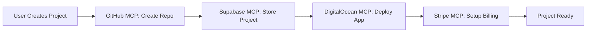

# 🔧 MCP Strategy: Platform Building & Platform Functionality

## Overview
Model Context Protocol (MCP) tools serve two critical functions in EverJust.dev:
1. **Building the Platform** - Automating development workflows in Cursor
2. **Platform Functionality** - Powering user features within the application

---

## 🏗️ **MCP for Platform Building** (Development Phase)

### **Current Setup Status**
- ✅ **Supabase MCP**: Database schema creation, migrations, RLS policies
- ✅ **GitHub MCP**: Repository automation, code deployment, CI/CD
- ✅ **DigitalOcean MCP**: App Platform deployment, domain management
- ✅ **Stripe MCP**: Billing setup, subscription management
- ✅ **Auth0 MCP**: User management, OAuth configuration, Management API access

### **Development Automation Workflows**

#### **Database Management (Supabase MCP)**
```typescript
// Automated via MCP tools:
// - supabase-create-project
// - supabase-run-sql  
// - supabase-create-table
// - supabase-setup-rls

// Example: Create user table with RLS
await supabaseMCP.runSQL(`
  CREATE TABLE users (
    id UUID DEFAULT uuid_generate_v4() PRIMARY KEY,
    auth0_id TEXT UNIQUE NOT NULL,
    email TEXT NOT NULL,
    subscription_tier TEXT DEFAULT 'free'
  );
  
  ALTER TABLE users ENABLE ROW LEVEL SECURITY;
  CREATE POLICY "Users can view own data" ON users FOR SELECT USING (auth0_id = auth.uid());
`);
```

#### **Repository Management (GitHub MCP)**
```typescript
// Automated via MCP tools:
// - github-create-repository
// - github-create-branch
// - github-create-pull-request
// - github-setup-webhooks

// Example: Auto-create client project repos
await githubMCP.createRepository({
  name: `${clientProject.name}-${clientProject.id}`,
  private: true,
  auto_init: true,
  template_repository: "everjust-dev/project-template"
});
```

#### **Deployment Automation (DigitalOcean MCP)**
```typescript
// Automated via MCP tools:
// - apps-create-app-from-spec
// - apps-update
// - certificate-create-custom
// - alert-policy-create

// Example: Deploy client project
await digitalOceanMCP.createApp({
  name: `${clientProject.subdomain}-app`,
  spec: {
    services: [{
      name: "web",
      github: {
        repo: clientProject.githubRepoUrl,
        branch: "main"
      },
      domains: [{
        domain: `${clientProject.subdomain}.everjust.dev`
      }]
    }]
  }
});
```

---

## 🚀 **MCP for Platform Functionality** (Runtime Features)

### **User-Facing Features Powered by MCP**

#### **1. Project Creation Workflow**


#### **2. Custom Domain Management**
```typescript
// When user adds custom domain:
// 1. DigitalOcean MCP: Create SSL certificate
// 2. DigitalOcean MCP: Update app domains
// 3. Supabase MCP: Update project record
// 4. ENTRI.COM API: Configure DNS (no MCP available)

export async function addCustomDomain(projectId: string, domain: string) {
  // Create SSL certificate via MCP
  const cert = await digitalOceanMCP.createCustomCertificate({
    name: `${domain}-ssl`,
    dns_names: [domain],
    type: 'lets_encrypt'
  });
  
  // Update app configuration
  await digitalOceanMCP.updateApp(projectId, {
    spec: {
      domains: [{ domain, certificate: cert.id }]
    }
  });
  
  // Update database record
  await supabaseMCP.updateTable('projects', projectId, {
    custom_domain: domain,
    ssl_certificate_id: cert.id
  });
}
```

#### **3. Real-time Project Monitoring**
```typescript
// Background monitoring via MCP
setInterval(async () => {
  const apps = await digitalOceanMCP.listApps();
  
  for (const app of apps) {
    const deployment = await digitalOceanMCP.getDeploymentStatus(app.id);
    
    // Update project status in database
    await supabaseMCP.updateTable('projects', app.id, {
      deployment_status: deployment.phase,
      last_deployment: deployment.updated_at
    });
    
    // Send alerts if needed
    if (deployment.phase === 'ERROR') {
      await stripe.billing.createInvoiceItem({
        customer: app.owner_id,
        description: `Deployment failed for ${app.name}`
      });
    }
  }
}, 30000); // Check every 30 seconds
```

---

## 📊 **MCP Performance & Optimization**

### **Current Tool Count Optimization**
```
Before Optimization: 219 tools total
├── Stripe: 21 tools ✅
├── DigitalOcean: 174 tools ⚠️ (TARGET: <100)
├── Playwright: 24 tools ✅
└── New servers: ~50 tools

Target: <200 tools total for optimal performance
```

### **DigitalOcean Tool Optimization Strategy**
**Disable Categories We Don't Use:**
- ❌ Raw Droplet Management (using App Platform)
- ❌ Kubernetes Tools (using App Platform)
- ❌ Block Storage (using App Platform storage)
- ❌ Advanced VPC (using default networking)
- ❌ CDN/Spaces (using Next.js optimization)

**Keep Essential Categories:**
- ✅ App Platform Management (core functionality)
- ✅ Domain/DNS Management (custom domains)
- ✅ Certificate Management (SSL automation)
- ✅ Basic Monitoring (health checks)
- ✅ Billing/Account (usage tracking)

---

## 🔄 **MCP Integration Patterns**

### **Development Phase Pattern**
```typescript
// Pattern: MCP tools automate infrastructure setup
class DevelopmentAutomation {
  async setupEnvironment() {
    // 1. Database setup
    await this.supabaseMCP.createProject();
    await this.supabaseMCP.runMigrations();
    
    // 2. Repository setup  
    await this.githubMCP.createRepo();
    await this.githubMCP.setupWebhooks();
    
    // 3. Deployment setup
    await this.digitalOceanMCP.createApp();
    await this.digitalOceanMCP.configureDomains();
  }
}
```

### **Runtime Platform Pattern**
```typescript
// Pattern: MCP tools power user features
class PlatformFeatures {
  async createUserProject(userId: string, projectSpec: ProjectSpec) {
    // Parallel execution for speed
    const [repo, dbProject, appDeployment] = await Promise.all([
      this.githubMCP.createRepository(projectSpec),
      this.supabaseMCP.insertProject(userId, projectSpec),
      this.digitalOceanMCP.createApp(projectSpec)
    ]);
    
    return { repo, dbProject, appDeployment };
  }
}
```

---

## 🎯 **Next Phase Implementation**

### **Phase 2A: Complete MCP Setup** (Target: 2 hours)
1. ✅ Fix Supabase MCP configuration
2. ✅ Optimize DigitalOcean tools (<100)
3. ✅ Test GitHub MCP connectivity
4. ✅ Document integration patterns

### **Phase 2B: Database Creation** (Target: 2 hours)
1. Use Supabase MCP to create production database
2. Run schema migrations via MCP
3. Setup RLS policies via MCP
4. Test Auth0 ↔ Supabase integration

### **Phase 2C: First Project Creation** (Target: 4 hours)
1. Implement project CRUD via Supabase MCP
2. Auto-create GitHub repos via GitHub MCP
3. Deploy to DigitalOcean via DO MCP
4. Test end-to-end user workflow

---

## 📝 **Documentation Standards**

Every MCP integration must include:
1. **Purpose**: What problem it solves
2. **Environment Variables**: Required config
3. **Error Handling**: Graceful degradation
4. **Performance Impact**: Tool count considerations
5. **Testing Strategy**: Validation approach
6. **Rollback Plan**: How to revert if needed

---

## ⚠️ **Critical Considerations**

### **Security**
- MCP tools have elevated permissions
- Environment variables must be secured
- Service role keys should be rotated regularly
- Monitor MCP tool usage for anomalies

### **Performance**
- MCP tools add latency to operations
- Batch operations when possible
- Cache MCP responses appropriately
- Monitor tool count vs. performance impact

### **Reliability**
- MCP tools can fail - always have fallbacks
- Implement circuit breakers for external services
- Log all MCP operations for debugging
- Set up alerts for MCP tool failures