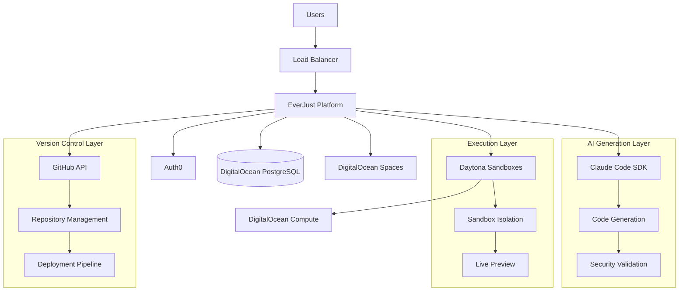

# EverJust.dev Backend System Design
## Comprehensive Multi-User AI Development Platform Architecture

**Version:** 2.0  
**Last Updated:** February 2025  
**Status:** Research Complete - Implementation Ready

---

## 🎯 Executive Summary

EverJust.dev aims to compete directly with **Lovable.dev** by providing a superior multi-user AI-powered development platform. This document outlines a comprehensive backend architecture that leverages **DigitalOcean infrastructure**, **Claude Code SDK**, **Daytona sandboxes**, **Auth0**, and **GitHub integration** to create a scalable, secure, and cost-effective platform.

### Key Differentiators vs Lovable.dev:
- **Superior Infrastructure**: DigitalOcean vs Supabase
- **Advanced AI Integration**: Claude Code + Daytona vs basic containers
- **Enhanced Security**: Multi-layer isolation and permission management
- **Better Scaling**: Enterprise-grade resource management
- **Cost Optimization**: Sophisticated resource allocation and lifecycle management

---

## 📋 Platform Overview

### Core Value Proposition
**Natural Language → Production Applications** with enterprise-grade security, scaling, and user management.

### Target User Flow
1. **User Signs In** → Auth0 authentication
2. **Describes Project** → Natural language input
3. **AI Generates Code** → Claude Code SDK processes request
4. **Secure Execution** → Daytona sandbox isolates code
5. **Version Control** → GitHub integration manages code
6. **Live Preview** → Real-time application preview
7. **Deployment Ready** → Production-ready applications

---

## 🏗️ System Architecture

### High-Level Components



---

## 🔐 Authentication & User Management

### Auth0 Integration Strategy

**Implementation:** Complete Auth0 setup with DigitalOcean PostgreSQL backend

**Features:**
- **Social Login**: GitHub, Google, Microsoft
- **Enterprise SSO**: SAML, OIDC for organizations
- **Multi-Factor Authentication**: SMS, Email, Authenticator apps
- **Role-Based Access Control**: User, Pro, Team, Enterprise tiers

**User Data Flow:**
```typescript
// User session management
interface EverJustUser {
  auth0_id: string;
  email: string;
  name: string;
  avatar_url?: string;
  subscription_tier: 'free' | 'pro' | 'team' | 'enterprise';
  resource_limits: ResourceLimits;
  created_at: timestamp;
  last_active: timestamp;
}

interface ResourceLimits {
  max_concurrent_projects: number;
  max_sandbox_hours: number;
  max_github_repos: number;
  ai_requests_per_month: number;
}
```

**User Management Best Practices:**
- Store minimal user data in our database
- Use Auth0 as the source of truth for authentication
- Implement proper GDPR compliance for EU users
- Cache user data with TTL for performance

---

## 🤖 AI Code Generation Architecture

### Claude Code SDK Integration

**Research Findings:**
- **Multi-Language Support**: Python, TypeScript, Go, Elixir SDKs available
- **Streaming Capabilities**: Real-time code generation feedback
- **Tool Integration**: Built-in Read, Write, Bash operations
- **Permission Modes**: `acceptEdits` for automation, custom permission levels
- **Error Handling**: Comprehensive error types for robust integrations

**Implementation Strategy:**

```typescript
// AI Code Generation Service
class AICodeGenerationService {
  private claudeClient: ClaudeCode;
  private rateLimiter: RateLimiter;
  
  async generateProject(request: ProjectRequest): Promise<ProjectResult> {
    // 1. Security validation
    const sanitizedPrompt = this.sanitizeUserInput(request.prompt);
    
    // 2. Context building
    const context = await this.buildProjectContext(request);
    
    // 3. AI generation with streaming
    const stream = this.claudeClient.query_stream(sanitizedPrompt, {
      allowed_tools: ['Read', 'Write', 'Bash'],
      permission_mode: 'controlled',
      max_turns: 10,
      timeout: 300000
    });
    
    // 4. Process and validate output
    return this.processCodeStream(stream, request.user_id);
  }
  
  private async buildProjectContext(request: ProjectRequest): Promise<Context> {
    return {
      user_preferences: await this.getUserPreferences(request.user_id),
      project_template: this.selectTemplate(request.project_type),
      security_constraints: this.getSecurityConstraints(request.user_tier),
      resource_limits: await this.getResourceLimits(request.user_id)
    };
  }
}
```

**Rate Limiting Strategy:**
- **Per-User Limits**: Based on subscription tier
- **Global Limits**: Prevent system overload
- **Queue Management**: Handle burst requests gracefully
- **Fallback Mechanisms**: Graceful degradation during high load

**Security Considerations:**
- **Input Sanitization**: Prevent prompt injection attacks  
- **Output Validation**: Scan generated code for security issues
- **Resource Limits**: Prevent excessive API usage
- **Audit Logging**: Track all AI interactions for compliance

---

## 🏃‍♂️ Daytona Sandbox Management

### Multi-User Sandbox Architecture

**Research Findings:**
- **Default Resources**: 1 vCPU, 1GB RAM, 3GiB disk (fully customizable)
- **Lifecycle Management**: Auto-stop (15min), auto-archive (7 days), auto-delete (configurable)
- **Security Models**: Container-based (default) with optional VM isolation
- **Enterprise Features**: RBAC, audit logs, GPU support, team management
- **API-Driven**: Full Python/TypeScript SDK with comprehensive management

**Sandbox Resource Management:**

```typescript
interface SandboxConfig {
  user_id: string;
  project_id: string;
  resources: {
    cpu: number;        // vCPU cores
    memory: number;     // GB RAM  
    disk: number;       // GB storage
    gpu?: boolean;      // Optional GPU access
  };
  lifecycle: {
    auto_stop_minutes: number;     // Default: 15
    auto_archive_days: number;     // Default: 7  
    auto_delete_days?: number;     // Optional
  };
  security: {
    isolation_level: 'container' | 'vm';
    network_access: 'full' | 'restricted' | 'none';
    file_system_access: 'full' | 'project_only';
  };
}

class SandboxManager {
  async createProjectSandbox(config: SandboxConfig): Promise<Sandbox> {
    // Apply user tier limits
    const enforcedConfig = this.enforceResourceLimits(config);
    
    // Create isolated environment
    const sandbox = await this.daytona.create({
      ...enforcedConfig,
      image: this.selectBaseImage(config.project_type),
      env_vars: this.buildEnvironmentVariables(config),
      public: false,  // Private by default
      volumes: this.setupPersistentVolumes(config)
    });
    
    // Setup monitoring and billing
    await this.setupSandboxMonitoring(sandbox.id, config.user_id);
    
    return sandbox;
  }
  
  async scaleUserSandboxes(user_id: string): Promise<void> {
    const userSandboxes = await this.getUserSandboxes(user_id);
    const userTier = await this.getUserTier(user_id);
    
    // Auto-scale based on usage patterns
    for (const sandbox of userSandboxes) {
      if (this.shouldScale(sandbox, userTier)) {
        await this.scaleSandbox(sandbox.id, this.calculateOptimalResources(sandbox));
      }
    }
  }
}
```

**Resource Allocation Strategy:**

| User Tier | Max Concurrent Sandboxes | Default Resources | Max Resources | Auto-Stop |
|-----------|---------------------------|-------------------|---------------|-----------|
| Free      | 1                        | 1 CPU, 1GB RAM   | 1 CPU, 2GB   | 15 min    |
| Pro       | 3                        | 2 CPU, 2GB RAM   | 4 CPU, 8GB   | 60 min    |
| Team      | 10                       | 2 CPU, 4GB RAM   | 8 CPU, 16GB  | 120 min   |
| Enterprise| Unlimited                | 4 CPU, 8GB RAM   | Custom        | Custom    |

**Cost Optimization:**
- **Smart Scaling**: Auto-adjust resources based on actual usage
- **Aggressive Lifecycle**: Quick cleanup of unused resources
- **Resource Pooling**: Share warm environments for common project types
- **Usage Analytics**: Track and optimize resource consumption patterns

---

## 🐙 GitHub Integration Strategy

### API Usage & Rate Limiting

**Research Findings:**
- **Rate Limits**: 5,000/hour (authenticated), 15,000/hour (Enterprise)
- **Secondary Limits**: 900 points/minute for endpoints, 100 concurrent requests
- **GraphQL Alternative**: Separate rate limit pool, more efficient for complex queries
- **Organization Features**: Higher limits, team management, advanced security

**Multi-User GitHub Integration:**

```typescript
class GitHubIntegrationService {
  private tokenPool: GitHubTokenPool;
  private rateLimiter: SmartRateLimiter;
  
  async createUserRepository(user_id: string, project: ProjectConfig): Promise<Repository> {
    // 1. Get optimal token for user
    const token = await this.tokenPool.getOptimalToken(user_id);
    
    // 2. Create repository with proper settings
    const repo = await this.createRepository({
      name: this.generateRepoName(project),
      description: project.description,
      private: project.visibility === 'private',
      auto_init: true,
      template_repository: this.selectTemplate(project.type)
    }, token);
    
    // 3. Setup repository configuration
    await Promise.all([
      this.setupBranchProtection(repo.id, token),
      this.configureCICD(repo.id, project.deployment_config, token),
      this.setupWebhooks(repo.id, user_id, token)
    ]);
    
    // 4. Store repository association
    await this.linkRepositoryToUser(user_id, repo.id, project.id);
    
    return repo;
  }
  
  async syncProjectToGitHub(project_id: string, code_changes: CodeChange[]): Promise<void> {
    const repo = await this.getProjectRepository(project_id);
    const token = await this.tokenPool.getTokenForRepo(repo.id);
    
    // Batch operations to minimize API calls
    const batch = new GitHubBatchOperation(token);
    
    for (const change of code_changes) {
      switch (change.type) {
        case 'create':
          batch.addFileCreation(change.path, change.content);
          break;
        case 'update':
          batch.addFileUpdate(change.path, change.content, change.sha);
          break;
        case 'delete':
          batch.addFileDeletion(change.path, change.sha);
          break;
      }
    }
    
    await batch.execute();
  }
}

class GitHubTokenPool {
  private tokens: Map<string, TokenInfo>;
  
  async getOptimalToken(user_id: string): Promise<string> {
    // 1. Check if user has personal token
    const userToken = await this.getUserPersonalToken(user_id);
    if (userToken && !this.isRateLimited(userToken)) {
      return userToken;
    }
    
    // 2. Use pool token with lowest usage
    const poolToken = this.selectLeastUsedToken();
    if (poolToken && !this.isRateLimited(poolToken)) {
      return poolToken;
    }
    
    // 3. Wait for rate limit reset
    await this.waitForRateLimit();
    return this.getOptimalToken(user_id);
  }
  
  private selectLeastUsedToken(): string {
    // Two random choices algorithm for load balancing
    const candidates = this.getRandomTokens(2);
    return candidates.reduce((best, current) => 
      this.tokens.get(current).usage < this.tokens.get(best).usage ? current : best
    );
  }
}
```

**GitHub Enterprise Strategy:**
- **Organization Account**: Get higher rate limits (15,000/hour)
- **GitHub Apps**: Use installation tokens for even higher limits
- **Token Rotation**: Implement smart token pooling for high-volume users
- **GraphQL Optimization**: Use GraphQL for complex queries to save rate limits

**Repository Management Features:**
- **Template Repositories**: Pre-configured project templates
- **Branch Protection**: Automated security policies
- **CI/CD Integration**: Automatic deployment pipelines
- **Webhook Automation**: Real-time synchronization with platform

---

## 🗄️ Database Architecture

### DigitalOcean PostgreSQL Design

**Schema Overview:**

```sql
-- Users and Authentication
CREATE TABLE users (
    id UUID PRIMARY KEY DEFAULT gen_random_uuid(),
    auth0_id VARCHAR(255) UNIQUE NOT NULL,
    email VARCHAR(255) UNIQUE NOT NULL,
    name VARCHAR(255),
    avatar_url TEXT,
    subscription_tier user_tier DEFAULT 'free',
    resource_limits JSONB DEFAULT '{}',
    created_at TIMESTAMP WITH TIME ZONE DEFAULT NOW(),
    updated_at TIMESTAMP WITH TIME ZONE DEFAULT NOW()
);

-- Projects and Code Generation
CREATE TABLE projects (
    id UUID PRIMARY KEY DEFAULT gen_random_uuid(),
    user_id UUID REFERENCES users(id) ON DELETE CASCADE,
    name VARCHAR(255) NOT NULL,
    description TEXT,
    project_type VARCHAR(100),
    visibility project_visibility DEFAULT 'private',
    
    -- AI Generation Metadata
    original_prompt TEXT,
    generation_history JSONB DEFAULT '[]',
    ai_model_version VARCHAR(50),
    
    -- GitHub Integration
    github_repo_id BIGINT,
    github_repo_url TEXT,
    default_branch VARCHAR(100) DEFAULT 'main',
    
    -- Sandbox Configuration
    sandbox_config JSONB DEFAULT '{}',
    current_sandbox_id UUID,
    
    status project_status DEFAULT 'draft',
    created_at TIMESTAMP WITH TIME ZONE DEFAULT NOW(),
    updated_at TIMESTAMP WITH TIME ZONE DEFAULT NOW()
);

-- Sandbox Management
CREATE TABLE sandboxes (
    id UUID PRIMARY KEY DEFAULT gen_random_uuid(),
    project_id UUID REFERENCES projects(id) ON DELETE CASCADE,
    daytona_sandbox_id VARCHAR(255) UNIQUE NOT NULL,
    
    -- Resource Configuration
    cpu_cores INTEGER DEFAULT 1,
    memory_gb INTEGER DEFAULT 1,
    disk_gb INTEGER DEFAULT 3,
    gpu_enabled BOOLEAN DEFAULT FALSE,
    
    -- Lifecycle Management
    auto_stop_minutes INTEGER DEFAULT 15,
    auto_archive_days INTEGER DEFAULT 7,
    auto_delete_days INTEGER,
    
    -- Current State
    status sandbox_status DEFAULT 'creating',
    last_active TIMESTAMP WITH TIME ZONE DEFAULT NOW(),
    resource_usage JSONB DEFAULT '{}',
    
    created_at TIMESTAMP WITH TIME ZONE DEFAULT NOW(),
    updated_at TIMESTAMP WITH TIME ZONE DEFAULT NOW()
);

-- Usage Analytics and Billing
CREATE TABLE usage_metrics (
    id UUID PRIMARY KEY DEFAULT gen_random_uuid(),
    user_id UUID REFERENCES users(id) ON DELETE CASCADE,
    project_id UUID REFERENCES projects(id) ON DELETE CASCADE,
    
    -- Resource Usage
    sandbox_hours_used DECIMAL(10,2) DEFAULT 0,
    ai_requests_count INTEGER DEFAULT 0,
    github_api_calls INTEGER DEFAULT 0,
    storage_gb_hours DECIMAL(10,2) DEFAULT 0,
    
    -- Billing Period
    billing_period DATE NOT NULL,
    cost_usd DECIMAL(10,2) DEFAULT 0,
    
    created_at TIMESTAMP WITH TIME ZONE DEFAULT NOW()
);

-- API Rate Limiting
CREATE TABLE rate_limits (
    id UUID PRIMARY KEY DEFAULT gen_random_uuid(),
    user_id UUID REFERENCES users(id) ON DELETE CASCADE,
    service VARCHAR(50) NOT NULL, -- 'claude', 'github', 'daytona'
    
    requests_count INTEGER DEFAULT 0,
    requests_limit INTEGER NOT NULL,
    window_start TIMESTAMP WITH TIME ZONE DEFAULT NOW(),
    window_duration INTERVAL DEFAULT INTERVAL '1 hour',
    
    UNIQUE(user_id, service, window_start)
);

-- Create custom types
CREATE TYPE user_tier AS ENUM ('free', 'pro', 'team', 'enterprise');
CREATE TYPE project_visibility AS ENUM ('public', 'private');
CREATE TYPE project_status AS ENUM ('draft', 'generating', 'active', 'archived', 'deleted');
CREATE TYPE sandbox_status AS ENUM ('creating', 'running', 'stopped', 'archived', 'deleted', 'error');
```

**Performance Optimizations:**
- **Indexing Strategy**: Optimized indexes for common query patterns
- **Connection Pooling**: Managed PostgreSQL connections with pgBouncer
- **Read Replicas**: Separate analytics queries from transactional workload
- **Caching Layer**: Redis for session data and frequently accessed data

**Backup & Recovery:**
- **Automated Backups**: Daily automated backups with point-in-time recovery
- **Cross-Region Replication**: Disaster recovery with DigitalOcean managed PostgreSQL
- **Data Retention**: 30-day backup retention with configurable policies

---

## 📊 Resource Management & Scaling

### Intelligent Resource Allocation

**Dynamic Scaling Strategy:**

```typescript
class ResourceManager {
  async optimizeUserResources(user_id: string): Promise<void> {
    const user = await this.getUser(user_id);
    const usage = await this.getUserUsage(user_id, '30 days');
    const predictions = await this.predictUsage(usage);
    
    // Optimize active sandboxes
    const activeSandboxes = await this.getActiveSandboxes(user_id);
    for (const sandbox of activeSandboxes) {
      const optimization = this.calculateOptimalResources(sandbox, predictions);
      if (optimization.should_scale) {
        await this.scaleSandbox(sandbox.id, optimization.target_resources);
      }
    }
    
    // Cleanup idle resources
    await this.cleanupIdleResources(user_id, user.subscription_tier);
  }
  
  async handleResourceContention(): Promise<void> {
    // Monitor global resource usage
    const globalUsage = await this.getGlobalResourceUsage();
    
    if (globalUsage.cpu_utilization > 0.8) {
      // Scale down free tier users first
      await this.scaleDownFreeTierSandboxes();
      
      // Scale up infrastructure if needed
      if (globalUsage.cpu_utilization > 0.9) {
        await this.requestInfrastructureScaling();
      }
    }
  }
}
```

**Cost Management:**

| Resource Type | Free Tier | Pro Tier | Team Tier | Enterprise |
|---------------|-----------|----------|-----------|------------|
| Sandbox Hours/Month | 10 | 100 | 500/user | Unlimited |
| Max Concurrent | 1 | 3 | 10/user | Custom |
| AI Requests/Month | 50 | 1,000 | 5,000/user | Custom |
| Storage/Project | 1GB | 10GB | 50GB | Custom |
| GitHub Repos | 5 | 25 | Unlimited | Unlimited |

---

## 🔒 Security Architecture

### Multi-Layer Security Model

**1. Authentication & Authorization**
- **Auth0 Integration**: Enterprise-grade authentication
- **JWT Tokens**: Secure API access with short expiration
- **Role-Based Access**: Granular permissions per resource
- **API Key Management**: Secure storage and rotation

**2. Sandbox Security**
- **Container Isolation**: Default security boundary
- **VM Isolation**: Enhanced security for enterprise users
- **Network Restrictions**: Controlled internet access
- **Resource Limits**: Prevent resource abuse

**3. Code Security**
- **Input Validation**: Prevent prompt injection attacks
- **Output Scanning**: Automated security analysis of generated code
- **Secret Detection**: Scan for exposed API keys and credentials
- **Dependency Scanning**: Check for vulnerable dependencies

**4. Data Protection**
- **Encryption at Rest**: All data encrypted in PostgreSQL
- **Encryption in Transit**: TLS 1.3 for all communications
- **GDPR Compliance**: Data residency and deletion rights
- **Audit Logging**: Comprehensive security event logging

```typescript
class SecurityService {
  async validateUserRequest(request: UserRequest): Promise<ValidationResult> {
    // 1. Authentication validation
    const authResult = await this.validateJWT(request.token);
    if (!authResult.valid) {
      throw new UnauthorizedError('Invalid authentication');
    }
    
    // 2. Authorization check
    const permission = await this.checkPermission(
      authResult.user_id, 
      request.resource_type, 
      request.action
    );
    if (!permission.allowed) {
      throw new ForbiddenError('Insufficient permissions');
    }
    
    // 3. Rate limiting
    const rateLimitResult = await this.checkRateLimit(
      authResult.user_id, 
      request.action
    );
    if (rateLimitResult.exceeded) {
      throw new RateLimitError('Rate limit exceeded');
    }
    
    // 4. Input validation
    const sanitized = await this.sanitizeInput(request.data);
    
    return {
      user_id: authResult.user_id,
      sanitized_data: sanitized,
      rate_limit_remaining: rateLimitResult.remaining
    };
  }
  
  async scanGeneratedCode(code: string, project_id: string): Promise<SecurityScanResult> {
    const results = await Promise.all([
      this.scanForSecrets(code),
      this.scanForVulnerabilities(code),
      this.scanForMaliciousPatterns(code),
      this.scanDependencies(code)
    ]);
    
    const issues = results.flatMap(r => r.issues);
    const severity = this.calculateMaxSeverity(issues);
    
    // Log security scan
    await this.logSecurityScan(project_id, severity, issues.length);
    
    return {
      passed: severity < SecurityLevel.HIGH,
      issues,
      recommendations: this.generateRecommendations(issues)
    };
  }
}
```

---

## ⚡ Performance & Monitoring

### Real-Time Performance Monitoring

**Key Metrics to Track:**
- **Response Times**: API endpoint performance
- **Resource Utilization**: CPU, memory, disk usage per user/project
- **AI Generation Speed**: Time to generate code
- **Sandbox Startup Time**: Time to create and start sandboxes
- **Error Rates**: Failed requests and their causes
- **User Engagement**: Feature usage and retention metrics

**Monitoring Stack:**
- **Application Monitoring**: Comprehensive logging and metrics
- **Infrastructure Monitoring**: DigitalOcean monitoring + custom dashboards
- **Error Tracking**: Real-time error detection and alerting
- **Performance Profiling**: Identify bottlenecks and optimization opportunities

```typescript
class MonitoringService {
  async trackUserAction(user_id: string, action: UserAction): Promise<void> {
    const metrics = {
      user_id,
      action: action.type,
      duration_ms: action.duration,
      success: action.success,
      resource_usage: action.resource_usage,
      timestamp: Date.now()
    };
    
    // Real-time metrics
    await this.metricsCollector.record(metrics);
    
    // Usage analytics
    await this.analyticsService.track(user_id, action);
    
    // Alert on anomalies
    if (this.isAnomalous(metrics)) {
      await this.alertingService.sendAlert(metrics);
    }
  }
  
  async optimizePerformance(): Promise<void> {
    const slowQueries = await this.findSlowDatabaseQueries();
    const highCPUProcesses = await this.findHighCPUProcesses();
    const memoryLeaks = await this.detectMemoryLeaks();
    
    // Automated optimizations
    await Promise.all([
      this.optimizeSlowQueries(slowQueries),
      this.scaleHighUsageResources(highCPUProcesses),
      this.restartLeakyServices(memoryLeaks)
    ]);
  }
}
```

---

## 🚀 Deployment & DevOps

### DigitalOcean Infrastructure

**Production Architecture:**
- **Load Balancer**: DigitalOcean Load Balancer with SSL termination
- **App Platform**: Auto-scaling Next.js application deployment
- **Database**: Managed PostgreSQL with automated backups
- **Storage**: DigitalOcean Spaces for file storage and CDN
- **Monitoring**: Integrated monitoring with alerts and dashboards

**CI/CD Pipeline:**
```yaml
# .github/workflows/deploy.yml
name: Deploy to Production

on:
  push:
    branches: [main]

jobs:
  deploy:
    runs-on: ubuntu-latest
    steps:
      - uses: actions/checkout@v4
      
      - name: Deploy to DigitalOcean App Platform
        uses: digitalocean/app_action@v1
        with:
          app_name: everjust-platform
          token: ${{ secrets.DIGITALOCEAN_ACCESS_TOKEN }}
          
      - name: Run Database Migrations
        run: |
          npm run db:migrate:prod
          
      - name: Health Check
        run: |
          curl -f https://api.everjust.dev/health || exit 1
          
      - name: Notify Team
        if: failure()
        run: |
          curl -X POST ${{ secrets.SLACK_WEBHOOK }} \
            -d '{"text":"🚨 Production deployment failed!"}'
```

**Infrastructure as Code:**
```hcl
# terraform/main.tf
resource "digitalocean_app" "everjust_platform" {
  spec {
    name   = "everjust-platform"
    region = "nyc1"

    service {
      name               = "web"
      environment_slug   = "node-js"
      instance_count     = 3
      instance_size_slug = "professional-s"
      
      github {
        repo           = "your-org/everjust-platform"
        branch         = "main"
        deploy_on_push = true
      }
      
      env {
        key   = "DATABASE_URL"
        value = digitalocean_database_cluster.main.uri
        type  = "SECRET"
      }
    }
  }
}

resource "digitalocean_database_cluster" "main" {
  name       = "everjust-db"
  engine     = "pg"
  version    = "15"
  size       = "db-s-2vcpu-4gb"
  region     = "nyc1"
  node_count = 2
}
```

---

## 💰 Cost Analysis & Optimization

### Projected Infrastructure Costs

**Monthly Cost Estimates:**

| Component | Configuration | Monthly Cost |
|-----------|---------------|--------------|
| App Platform | 3x Professional-S instances | $72 |
| PostgreSQL | 2-node cluster, 4GB RAM | $60 |
| Load Balancer | Standard with SSL | $10 |
| Spaces Storage | 100GB + CDN | $5 |
| Monitoring | Basic monitoring | $0 |
| **Total Base** | | **$147/month** |

**User Scaling Costs:**

| Users | Daytona Sandboxes | Additional Monthly Cost |
|-------|-------------------|-------------------------|
| 100   | ~50 active       | $200 |
| 500   | ~200 active      | $800 |
| 1,000 | ~400 active      | $1,600 |
| 5,000 | ~1,500 active    | $6,000 |

**Revenue Model:**
- **Free Tier**: 0-10 hours/month sandbox usage
- **Pro Tier**: $19/month - 100 hours + premium features
- **Team Tier**: $49/user/month - 500 hours + collaboration
- **Enterprise**: Custom pricing - unlimited usage + support

**Break-Even Analysis:**
- Break-even at ~50 Pro users or ~20 Team users
- Profitable scaling starts at ~100 active users
- Target: 1,000 users by month 6, 5,000 users by year 1

---

## 🎯 Implementation Roadmap

### Phase 1: Core Platform (Months 1-2)
**Claude Ultrathink**: "Analyze the optimal order for implementing core platform features to minimize technical debt and maximize user value delivery"

- ✅ **Foundation Complete**: Auth0 + DigitalOcean PostgreSQL + SSL fixes
- 🔄 **Next Priority**: 
  1. **User Project Management** - Complete CRUD operations for projects
  2. **Claude Code Integration** - Basic AI generation with streaming
  3. **Daytona Sandbox Basic Integration** - Create and manage sandboxes
  4. **Simple GitHub Integration** - Repository creation and basic sync

### Phase 2: Advanced Features (Months 2-3)
**Claude Ultrathink**: "Design the integration patterns between AI generation, sandbox execution, and version control that will handle enterprise-scale concurrent users"

- **Advanced AI Features** - Multi-turn conversations, context preservation
- **Sophisticated Sandbox Management** - Resource optimization, lifecycle automation
- **Enhanced GitHub Integration** - Advanced repository management, CI/CD setup
- **Real-time Collaboration** - Live editing, shared sandboxes

### Phase 3: Enterprise Features (Months 3-4)
**Claude Ultrathink**: "Architect the enterprise features that will differentiate EverJust.dev from competitors and enable premium pricing"

- **Team Management** - Organizations, role-based access, usage analytics
- **Advanced Security** - VM isolation, audit logging, compliance features
- **Performance Optimization** - Advanced caching, resource prediction
- **Enterprise Integrations** - SSO, custom deployments, dedicated infrastructure

### Phase 4: Scale & Polish (Months 4-6)
**Claude Ultrathink**: "Optimize the platform architecture for 10x user growth while maintaining performance and cost efficiency"

- **Horizontal Scaling** - Multi-region deployment, load optimization
- **Advanced Analytics** - Usage insights, performance monitoring, cost optimization
- **Mobile Experience** - Progressive web app, mobile-optimized interfaces
- **Marketplace Features** - Template sharing, community integrations

---

## 🚀 Success Metrics & KPIs

### Technical KPIs
- **Uptime**: 99.9% availability target
- **Response Time**: <200ms API response time
- **Sandbox Startup**: <30 seconds average
- **Code Generation**: <10 seconds for typical requests
- **Error Rate**: <1% of requests

### Business KPIs
- **User Growth**: 50% month-over-month growth target
- **Conversion Rate**: 15% free-to-paid conversion
- **Retention**: 85% monthly active user retention
- **Revenue Growth**: $50K ARR by month 6, $500K ARR by year 1

### User Experience KPIs
- **Time to First Project**: <5 minutes from signup
- **Project Success Rate**: 90% of generated projects are deployable
- **User Satisfaction**: 4.5+ star rating, NPS >50

---

## 🔗 Integration Specifications

### API Design Patterns

**RESTful API Structure:**
```
GET    /api/v1/projects          # List user projects
POST   /api/v1/projects          # Create new project
GET    /api/v1/projects/:id      # Get project details
PUT    /api/v1/projects/:id      # Update project
DELETE /api/v1/projects/:id      # Delete project

POST   /api/v1/projects/:id/generate    # Generate code
GET    /api/v1/projects/:id/sandbox     # Get sandbox status
POST   /api/v1/projects/:id/sandbox     # Create/start sandbox
DELETE /api/v1/projects/:id/sandbox     # Stop sandbox

GET    /api/v1/projects/:id/github      # GitHub integration status
POST   /api/v1/projects/:id/github      # Setup GitHub integration
PUT    /api/v1/projects/:id/github      # Sync to GitHub

GET    /api/v1/user/usage               # User resource usage
GET    /api/v1/user/billing             # Billing information
```

**WebSocket Endpoints:**
```typescript
// Real-time updates
interface WebSocketEvents {
  'project:generation:start': { project_id: string };
  'project:generation:progress': { project_id: string; progress: number; step: string };
  'project:generation:complete': { project_id: string; files: FileChange[] };
  'sandbox:status': { sandbox_id: string; status: SandboxStatus };
  'sandbox:logs': { sandbox_id: string; logs: string };
}
```

---

## 📝 Final Recommendations

### Technical Priorities
1. **Start with MVP**: Focus on core user flow first
2. **Security First**: Implement security from day one, not as an afterthought
3. **Monitoring Early**: Build observability into the platform from the beginning
4. **Cost Optimization**: Design for efficient resource usage from the start

### Business Strategy
1. **Freemium Model**: Generous free tier to drive adoption
2. **Enterprise Focus**: Target teams and organizations for revenue
3. **Developer Experience**: Priority on ease of use and reliability
4. **Community Building**: Foster user community and feedback loops

### Risk Mitigation
1. **Vendor Lock-in**: Design for portability between cloud providers
2. **Rate Limiting**: Build robust handling for third-party API limits
3. **Security Breaches**: Implement defense-in-depth security model
4. **Cost Overruns**: Aggressive resource lifecycle management

---

**End of Document**

*This architecture is designed to be implementation-ready while remaining flexible for future evolution. Each component has been researched and validated for technical feasibility and business viability.*

**Next Steps:**
1. Review and approve this architecture
2. Begin Phase 1 implementation
3. Setup monitoring and observability
4. Iterate based on user feedback and usage patterns